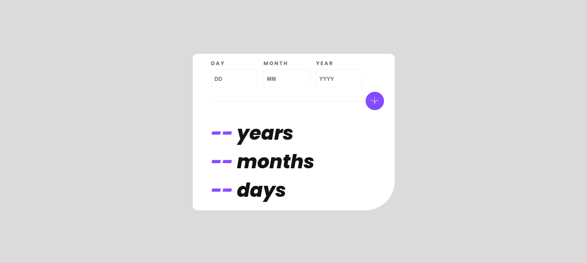
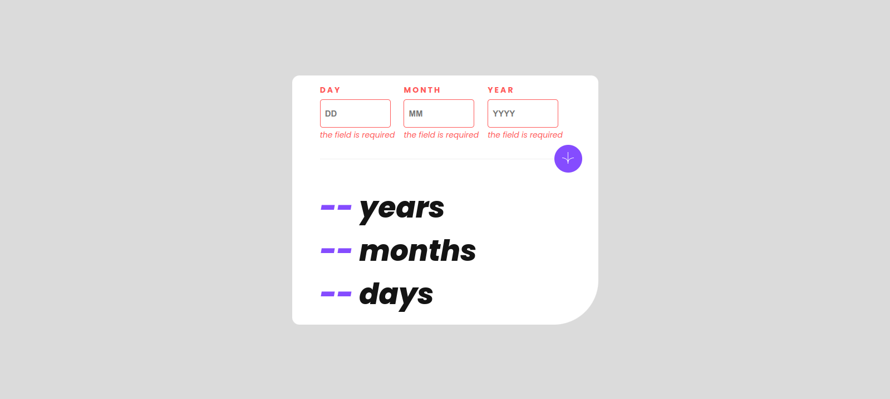

# Frontend Mentor - Age calculator app solution

This is a solution to the
[Age calculator app challenge on Frontend Mentor](https://www.frontendmentor.io/challenges/age-calculator-app-dF9DFFpj-Q).

If you want to check out all my front-end Exercises Look here 👇

https://github.com/ahmad-kashkoush/FrontEnd-Mentors-exercices

## Table of contents

- [Overview](#overview)
  - [The challenge](#the-challenge)
  - [Screenshot](#screenshot)
  - [Links](#links)
- [My process](#my-process)
  - [Built with](#built-with)
  - [What I learned](#what-i-learned)

## Overview

### The challenge

Users should be able to:

- View an age in years, months, and days after submitting a valid date through
  the form
- Receive validation errors if:
  - Any field is empty when the form is submitted
  - The day number is not between 1-31
  - The month number is not between 1-12
  - The year is in the future
  - The date is invalid e.g. 31/04/1991 (there are 30 days in April)
- View the optimal layout for the interface depending on their device's screen
  size
- See hover and focus states for all interactive elements on the page

### Screenshot

 

## My process

### Built with

- Semantic HTML5 markup
- CSS custom properties
- Flexbox
- Mobile-first workflow

### What I learned

- How to calculate number of years, days, months between two dates

```js
const oneDayMs = 1000 * 60 * 60 * 24;

const diffMs = endDate.getTime() - startDate.getTime();
const diffDays = Math.floor(diffMs / oneDayMs);
const years = Math.floor(diffDays / 365);
const months = Math.floor(diffDays / 30.44) % 12;
const days = diffDays - years * 365 - Math.floor(months * 30.44);
return [years, days, months];
```

- Date validation
